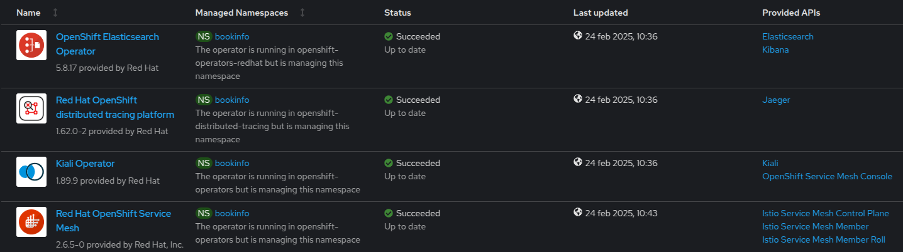

# Service Mesh Demo

## 1. Requisiti

### 1.1 Setup Operators

    1. OpenShift Elasticsearch Operator
    2. Red Hat OpenShift distributed tracing platform
    3. Kiali Operator
    4. Red Hat OpenShift Service Mesh



### 1.2 Definizione ServiceMeshControlPlane

```yaml
apiVersion: maistra.io/v2
kind: ServiceMeshControlPlane
metadata:
  name: basic
  namespace: istio-system
spec:
  addons:
    grafana:
      enabled: true
    jaeger:
      install:
        storage:
          type: Memory
    kiali:
      enabled: true
    prometheus:
      enabled: true
  gateways:
    openshiftRoute:
      enabled: true
  mode: MultiTenant
  policy:
    type: Istiod
  profiles:
    - default
  telemetry:
    type: Istiod
  tracing:
    sampling: 10000
    type: Jaeger
  version: v2.6
```

## 2. Aggiunta di servizi in Service Mesh

### 2.1 Definizione ServiceMeshMemberRoll

Questo oggetto fornisce agli amministratori di OpenShift Service Mesh un modo per delegare le autorizzazioni e per aggiungere progetti a una mesh.

```yaml
apiVersion: maistra.io/v1
kind: ServiceMeshMemberRoll
metadata:
  name: default
  namespace: istio-system
spec:
  members:
    - bookinfo
```

La Service Mesh definisce anche le network policy nella control plane della Service Mesh e nei namespace partecipanti, regolando il traffico all'interno della mesh.

```yaml
oc get netpol -n bookinfo

istio-expose-route-basic
istio-mesh-basic
```

## 3. Deploy Bookinfo

L'applicazione Bookinfo visualizza informazioni simili ad un negozio di libri online. L'applicazione mostra una pagina che descrive il libro, i suoi dettagli (ISBN, numero di pagine e altre informazioni) e le recensioni ricevute.

L'applicazione Bookinfo è composta da questi microservizi:

Il microservizio productpage chiama i microservizi details e reviews per popolare la pagina.
Il microservizio details contiene informazioni sui libri.
Il microservizio reviews contiene le recensioni dei librie e chiama il microservizio dei ratings.
Il microservizio dei ratings contiene le informazioni sulle classifiche dei libri che accompagnano le recensioni.

Esistono tre versioni del microservizio reviews:

- La versione v1 non chiama il servizio di ratings.
- La versione v2 chiama il Servizio reviews e visualizza ogni valutazione con stelle nere.
- La versione v3 chiama il Servizio reviews e visualizza ogni valutazione con stelle rosse.

-> [bookinfo.yaml](https://raw.githubusercontent.com/nictore/ocp-demo/refs/heads/main/mesh/bookinfo.yaml)

## 4. Sidecar Injection

Annotations nei deployment per abilitare l'injection del proxy istio

```yaml
apiVersion: apps/v1
kind: Deployment
metadata:
    [...]
spec:
  template:
    metadata:
      annotations:
        sidecar.istio.io/inject: 'true'
```

E' possibile sfruttare l'injection automatica dei sidecar configurando una label direttamente sul namespace: 

```yaml
$ oc label namespace <nome_namespace> istio-injection=enabled
```

## 5. Versioning del deployment

```yaml
apiVersion: apps/v1
kind: Deployment
metadata:
    [...]
spec:
  template:
    metadata:
      labels:
        app: reviews
        version: v1
```

## 6. Definizione IngressGateway

Una risorsa gateway rappresenta un bilanciatore di carico che opera ai margini della mesh, gestendo le connessioni HTTP/TCP in entrata e in uscita. La sua specifica descrive:

- un set di porte che devono essere esposte
- il tipo di protocollo da utilizzare
- la configurazione SNI per il bilanciatore di carico e altro ancora.

```yaml
apiVersion: networking.istio.io/v1beta1
kind: Gateway
metadata:
  name: bookinfo-gateway
spec:
  selector:
    istio: ingressgateway # use istio default controller
  servers:
  - port:
      number: 8080
      name: http
      protocol: HTTP
    hosts: 
    - "*"
```
A differenza di una Ingress o Rotta standard, non include alcuna configurazione di routing del traffico. Il routing del traffico è invece configurato utilizzando l'oggetto VirtualService.

## 7. Definizione VirtualServices

Per specificare il routing e per far funzionare il gateway come previsto, bisogna anche associare il gateway a un virtualService:

```yaml
apiVersion: networking.istio.io/v1beta1
kind: VirtualService
metadata:
  name: bookinfo
spec:
  hosts:
  - "*"
  gateways:
  - bookinfo-gateway
  http:
  - match:
    - uri:
        exact: /productpage
    - uri:
        prefix: /static
    - uri:
        exact: /login
    - uri:
        exact: /logout
    - uri:
        prefix: /api/v1/products
    route:
    - destination:
        host: productpage
        port:
          number: 9080
```

## 8. Gestione del traffico

Per il microservizio reviews definiamo un oggetto DestinationRule per identificare i subset in base alla versione del deployment, configura quindi tre diversi sottoinsiemi:

```yaml
apiVersion: networking.istio.io/v1beta1
kind: DestinationRule
metadata:
  name: reviews
  namespace: bookinfo
spec:
  host: reviews
  subsets:
    - labels:
        version: v1
      name: v1
    - labels:
        version: v2
      name: v2
    - labels:
        version: v3
      name: v3
  trafficPolicy:
    loadBalancer:
      simple: RANDOM
```

### Scenario 1

Veicoliamo tutto il traffico solo per la versione v1 di review e poi solo per v2

```yaml
apiVersion: networking.istio.io/v1beta1
kind: VirtualService
metadata:
  name: reviews
spec:
  hosts:
  - reviews
  http:
  - route:
    - destination:
        host: reviews
        subset: v1   #v2
```

### Scenario 2

Veicoliamo una percentuale di traffico sulle 2 istanze v1 e v2

```yaml
apiVersion: networking.istio.io/v1beta1
kind: VirtualService
metadata:
  name: reviews
spec:
  hosts:
    - reviews
  http:
  - route:
    - destination:
        host: reviews
        subset: v1
      weight: 80
    - destination:
        host: reviews
        subset: v2
      weight: 20
```

### Scenario 3

Set header http, veicola traffico solo su v2 solo se corrisponde un determinato utente

```yaml
apiVersion: networking.istio.io/v1beta1
kind: VirtualService
metadata:
  name: reviews
spec:
  hosts:
  - reviews
  http:
  - match:
    - headers:
        end-user:
          exact: jason
    route:
    - destination:
        host: reviews
        subset: v2
  - route:
    - destination:
        host: reviews
        subset: v3
```

### Scenario 4

Fault injection microservizio details // Aprire jaeger

```yaml
apiVersion: networking.istio.io/v1beta1
kind: DestinationRule
metadata:
  name: details
spec:
  host: details
  subsets:
  - name: v1
    labels:
      version: v1
---
apiVersion: networking.istio.io/v1beta1
kind: VirtualService
metadata:
  name: details
spec:
  hosts:
  - details
  http:
  - fault:
      abort:
        httpStatus: 555
        percentage:
          value: 100
    route:
    - destination:
        host: details
        subset: v1
```

### Scenario 5

Delay

```yaml
apiVersion: networking.istio.io/v1beta1
kind: VirtualService
metadata:
  name: details
spec:
  hosts:
  - details
  http:
  - fault:
      delay:
        fixedDelay: 7s
        percentage:
          value: 100
    route:
    - destination:
        host: details
        subset: v1
```

### Scenario 6

Mirroring del traffico // Aprire grafana
Il mirroring invia una copia del traffico live a un servizio mirrorato.

```yaml
apiVersion: networking.istio.io/v1beta1
kind: VirtualService
metadata:
  name: reviews
spec:
  hosts:
    - reviews
  http:
  - route:
    - destination:
        host: reviews
        subset: v1
      weight: 100
    mirror:
        host: reviews
        subset: v2
    mirrorPercentage:
    value: 100.0
```

### Scenario 7

Circuit breaking

Il circuit breaking è un pattern importante per la creazione di applicazioni microservice resilienti. Il circuit breaking consente di scrivere applicazioni che limitano l'impatto di guasti, picchi di latenza e altri effetti indesiderati delle peculiarità della rete.

```yaml
apiVersion: networking.istio.io/v1beta1
kind: DestinationRule
metadata:
  name: details
spec:
  host: details
  subsets:
  - name: v1
    labels:
      version: v1
  trafficPolicy:
    connectionPool:
      tcp:
        maxConnections: 1
      http:
        http1MaxPendingRequests: 1
        maxRequestsPerConnection: 1
    outlierDetection:
      consecutive5xxErrors: 1
      interval: 1s
      baseEjectionTime: 3m
      maxEjectionPercent: 100
```
```yaml
maxConnections: 1 e http1MaxPendingRequests: 1
```

Queste regole indicano che se si supera più di una connessione e contemporanea, dovrebbero verificarsi alcuni errori quando istio-proxy tenta di aprire ulteriori richieste e connessioni.