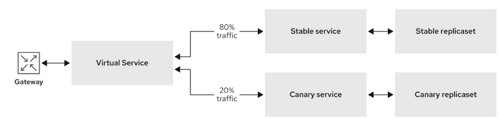

# Argo Rollouts & Istio Service Mesh

Il supporto di Istio all'interno di Argo Rollouts utilizza le risorse Gateway e VirtualService per gesire il routing del traffico.

- Gateway: puoi utilizzare un Gateway per gestire il traffico in entrata e in uscita per la tua mesh. Il gateway è il punto di ingresso della Service Mesh e gestisce le richieste di traffico inviate a un'applicazione.

- VirtualService: definisce le regole di routing del traffico e la percentuale di traffico che va ai servizi sottostanti, come i servizi stable e canary

Quando si utilizza la Service Mesh, Argo Rollouts modifica automaticamente la risorsa VirtualService per controllare la percentuale di traffico suddiviso tra le versioni stable e canary. Nel diagramma seguente, il 20 % del traffico viene inviato alla versione canary dell'applicazione dopo la prima promotion e quindi l'80% viene inviato alla versione stabile del servizio.



## 1. Requisiti

- Red Hat Openshift GitOps
- Argo Rollouts
- Argo Rollouts CLI
- Openshift Service Mesh

## 2. Definizione ServiceMeshControlPlane

```yaml
apiVersion: maistra.io/v2
kind: ServiceMeshControlPlane
metadata:
  name: basic
  namespace: istio-system
spec:
  addons:
    grafana:
      enabled: true
    jaeger:
      install:
        storage:
          type: Memory
    kiali:
      enabled: true
    prometheus:
      enabled: true
  gateways:
    openshiftRoute:
      enabled: true
  mode: MultiTenant
  policy:
    type: Istiod
  profiles:
    - default
  telemetry:
    type: Istiod
  tracing:
    sampling: 10000
    type: Jaeger
  version: v2.6
```

## 3. Definizione ServiceMeshMemberRole

```yaml
apiVersion: maistra.io/v1
kind: ServiceMeshMemberRoll
metadata:
  name: default
  namespace: istio-system
spec:
  members:
    - istio-rollouts
```

### 3.1 Injection automatica dei sidecar

E' possibile sfruttare l'injection automatica dei sidecar configurando una label direttamente sul namespace eseguendo il comando:

```yaml
oc label namespace istio-rollouts istio-injection=enabled
```

## 4. Crezione risorse

### 4.1 Gateway

```yaml
apiVersion: networking.istio.io/v1alpha3
kind: Gateway
metadata:
  name: rollouts-demo-gateway 
spec:
  selector:
    istio: ingressgateway 
  servers:
  - port:
      number: 80
      name: http
      protocol: HTTP
    hosts:
    - "*"
```

### 4.2 Servizi

```yaml
apiVersion: v1
kind: Service
metadata:
  name: rollouts-demo-stable
spec:
  ports: 
  - port: 80
    targetPort: http
    protocol: TCP
    name: http
  selector: 
    app: rollouts-demo
```
```yaml
apiVersion: v1
kind: Service
metadata:
  name: rollouts-demo-canary
spec:
  ports: 
  - port: 80
    targetPort: http
    protocol: TCP
    name: http
  selector: 
    app: rollouts-demo
```

### 4.3 VirtualService

```yaml
apiVersion: networking.istio.io/v1alpha3
kind: VirtualService
metadata:
  name: rollouts-demo-vsvc
spec:
  gateways:
  - rollouts-demo-gateway 
  hosts:
  - rollouts-demo-vsvc.local
  http:
  - name: primary
    route:
    - destination:
        host: rollouts-demo-stable 
        port:
          number: 15372 
      weight: 100
    - destination:
        host: rollouts-demo-canary 
        port:
          number: 15372
      weight: 0
  tls: 
  - match:
    - port: 3000
      sniHosts:
      - rollouts-demo-vsvc.local
    route:
    - destination:
        host: rollouts-demo-stable
      weight: 100
    - destination:
        host: rollouts-demo-canary
      weight: 0
```

### 4.4 Rollout

```yaml
apiVersion: argoproj.io/v1alpha1
kind: Rollout
metadata:
  name: rollouts-demo
spec:
  replicas: 5
  strategy:
    canary:
      canaryService: rollouts-demo-canary 
      stableService: rollouts-demo-stable 
      trafficRouting:
        istio:
          virtualServices:
          - name: rollouts-demo-vsvc
            routes:
            - primary
      steps: 
      - setWeight: 20
      - pause: {}
      - setWeight: 40
      - pause: {}
      - setWeight: 60
      - pause: {duration: 30}
      - setWeight: 80
      - pause: {duration: 60}
  revisionHistoryLimit: 2
  selector: 
    matchLabels:
      app: rollouts-demo
  template:
    metadata:
      labels:
        app: rollouts-demo
        istio-injection: enabled
    spec:
      containers:
      - name: rollouts-demo
        image: argoproj/rollouts-demo:blue
        ports:
        - name: http
          containerPort: 8080
          protocol: TCP
        resources:
          requests:
            memory: 32Mi
            cpu: 5m
```

Verificare che la service mesh indirizzi il 100% del traffico verso la versione stabile dell'applicazione.

```yaml
oc argo rollouts get rollout rollouts-demo --watch -n istio-rollouts
```

## 5. Simulare nuova versione canary

Simula la nuova versione canary dell'applicazione modificando l'immagine del container distribuita durante il rollout

```yaml
oc argo rollouts set image rollouts-demo rollouts-demo=argoproj/rollouts-demo:yellow -n istio-rollouts
```

Di conseguenza, l'immagine del container distribuita durante il rollout viene modificata e il rollout avvia una nuova distribuzione canary

## 6. Promote

```yaml
oc argo rollouts promote rollouts-demo -n istio-rollouts
```

Il 60% del traffico viene indirizzato al servizio stable e il 40% al servizio canary. Il deployment viene quindi messo in pausa a tempo indeterminato finché non lo si promuove manualmente al livello successivo.

### 6.1 Step finale (100%)

Aumentare il peso del traffico nella versione canary al 100% ed eliminare il traffico nella precedente versione stabile dell'applicazione eseguendo il seguente comando:

```yaml
oc argo rollouts promote rollouts-demo -n istio-rollouts
```

Dopo il completamento con successo, il peso sul servizio stable è del 100% e 0% sul servizio canary.