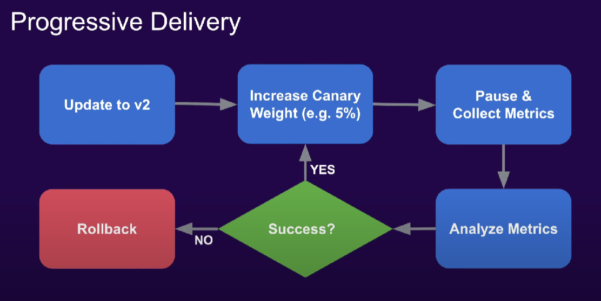

# Argo Rollouts

## 1. Overview

Argo Rollouts è un controller Kubernetes e un set di CRD che forniscono funzionalità di distribuzione avanzate come blue-green, canary, canary analysis, sperimentazione e funzionalità di distribuzione progressiva su Kubernetes

Argo Rollouts si integra con gli Ingress Controllers e le service mesh, sfruttando le loro capacità di modellazione del traffico per spostare gradualmente il traffico alla nuova versione durante un aggiornamento. Inoltre, Rollouts può interrogare e interpretare le metriche di vari provider per verificare i KPI e guidare la promozione o il rollback automatizzati durante un aggiornamento.



Il Deployment di Kubernetes supporta la strategia di "RollingUpdate" che fornisce un set base di garanzie di sicurezza durante un aggiornamento (readiness probes). Tuttavia, la strategia di RollingUpdate presente alcune limitazioni:

- Pochi controlli sulla velocità del rollout
- Impossibilità di controllare il flusso di traffico verso la nuova versione
- Le readiness probes non sono adatte per controlli più approfonditi, stress o una tantum
- Nessuna possibilità di interrogare metriche esterne per verificare un aggiornamento
- Può interrompere la progressione, ma non è in grado di annullare automaticamente l'aggiornamento

Per questi motivi, in ambienti di produzione su larga scala, un RollingUpdate è spesso considerato una procedura di aggiornamento troppo rischiosa poiché non fornisce alcun controllo e rollback automatico in caso di guasti.

**Vantaggi di Argo Rollouts**

- Funzionalità di distribuzione avanzate
- Ottimizzazione delle strategie di distribuzione avanzate esistenti come blue-green o canary
- Aggiornamenti senza tempi di inattività per i Deployments
- Spostamento del traffico ponderato
- Possibilità di eseguire test senza che alcun nuovo traffico raggiunga l'ambiente di produzione
- Rollback e promozioni automatizzati
- Query metriche personalizzabili e analisi degli indicatori chiave delle prestazioni aziendali (KPI)
- Integrazione con controller di ingresso e Red Hat OpenShift Service Mesh per il routing avanzato del traffico

## 2. Installation

### 2.1 Prerequisiti

- Red Hat Openshift GitOps (Operator)
- Argo Rollouts (Helm)
- Argo Rollouts CLI

## 3. Creazione namespace

Creiamo il progetto in cui desideriamo creare e configurare una risorsa personalizzata (CR) di Rollout.

```yaml
oc new-project demo-rollout
```

## 4. Crezione risorsa Rollout

```yaml
apiVersion: argoproj.io/v1alpha1
kind: Rollout
metadata:
  name: rollouts-demo
spec:
  replicas: 5
  strategy:
    canary: # La strategia di deployment che il rollout userà
      steps: # Specifica gli step per il rollout. Questo esempio indirizza gradualmente il 20%, 40%, 60% e 80% del traffico alla versione canary
      - setWeight: 20 
      - pause: {} # Specificare al controller Argo Rollouts di sospendere indefinitamente finché non viene trovata una richiesta di promozione
      - setWeight: 40
      - pause: {duration: 45}  
      - setWeight: 60
      - pause: {duration: 20}
      - setWeight: 80
      - pause: {duration: 10}
  revisionHistoryLimit: 2
  selector:
    matchLabels:
      app: rollouts-demo
  template: 
    metadata:
      labels:
        app: rollouts-demo
    spec:
      containers:
      - name: rollouts-demo
        image: argoproj/rollouts-demo:blue
        ports:
        - name: http
          containerPort: 8080
          protocol: TCP
        resources:
          requests:
            memory: 32Mi
            cpu: 5m
```

## 5. Creazione dei servizi Kubernetes destinati al rollout-demo

```yaml
apiVersion: v1
kind: Service
metadata:
  name: rollouts-demo
spec:
  ports: 
  - port: 80
    targetPort: http
    protocol: TCP
    name: http

  selector: 
    app: rollouts-demo
```

Si può osservare l'andamento del rollout utilizzando questo comando:

```yaml
oc argo rollouts get rollout rollouts-demo --watch -n demo-rollout
```

## 6. Aggiornamento del Rollout

Quando si aggiorna la risorsa personalizzata (CR) di Rollout con modifiche ai campi .spec.template.spec, ad esempio la versione dell'immagine del contenitore, vengono creati nuovi pod tramite ReplicaSet utilizzando la versione aggiornata dell'immagine del container.

```yaml
apiVersion: argoproj.io/v1alpha1
kind: Rollout
metadata:
  name: rollouts-demo
spec:
  replicas: 5
  strategy:
    canary:
      steps:
      - setWeight: 20 
      - pause: {}
      - setWeight: 40
      - pause: {duration: 45}  
      - setWeight: 60
      - pause: {duration: 20}
      - setWeight: 80
      - pause: {duration: 10}
  revisionHistoryLimit: 2
  selector:
    matchLabels:
      app: rollouts-demo
  template: 
    metadata:
      labels:
        app: rollouts-demo
    spec:
      containers:
      - name: rollouts-demo
        image: argoproj/rollouts-demo:yellow
        ports:
        - name: http
          containerPort: 8080
          protocol: TCP
        resources:
          requests:
            memory: 32Mi
            cpu: 5m
```

L'immagine del container distribuita durante il rollout viene modificata e il rollout avvia una nuova distribuzione canary.

Osserva l'avanzamento del tuo rollout eseguendo il seguente comando:

```yaml
oc argo rollouts get rollout rollouts-demo --watch -n demo-rollout
```

## 7. Promuovere il Rollout

Poiché il rollout è ora in pausa, in qualità di amministratore del cluster bisogna promuoverlo manualmente per consentirgli di procedere alla fase successiva.

```yaml
oc argo rollouts promote rollouts-demo -n demo-rollout
```

Ciò aumenta il peso del traffico al 40% nella versione canary. (come visto nella prima definizione del Rollout)

Poiché i restanti passaggi definiti nel Rollout hanno durate definite, ad esempio pausa: {duration: 45}, il controller Argo Rollouts attende tale durata e poi passa automaticamente al passaggio successivo.

Una volta completati correttamente tutti i passaggi, il nuovo oggetto ReplicaSet viene contrassegnato come stabile.

## 8. Interruzione manuale del rollout

Quando si usa un deployment canary, il rollout distribuisce una versione canary iniziale dell'applicazione. Dopo aver verificato la versione canary e averla promossa a stabile, la nuova versione stabile viene resa disponibile a tutti gli utenti.

Tuttavia, a volte vengono scoperti bug, errori o problemi di distribuzione nella versione canary e potrebbe essere necessario annullare il rollout e ripristinare una versione stabile dell'applicazione.

L'interruzione di un rollout elimina le risorse della nuova versione canary e ripristina la precedente versione stabile dell'applicazione. Di conseguenza, tutto il traffico che era indirizzato alla versione canary torna alla versione stabile.

- Aggiorniamo così l'immagine del container:

```yaml
oc argo rollouts set image rollouts-demo rollouts-demo=argoproj/rollouts-demo:red -n demo-rollout
```

- Verifichiamo che il rollout distribuisca la nuova versione canary e raggiunga lo stato di pausa

```yaml
oc argo rollouts get rollout rollouts-demo --watch -n demo-rollout
```

- Quindi interrompiamo l'aggiornamento del rollout eseguendo il comando:

```yaml
oc argo rollouts abort rollouts-demo -n demo-rollout
```

Il controller Argo Rollouts elimina le risorse canary dell'applicazione e torna alla versione stabile. Possiamo verificarlo nuovamente eseguendo il comando:

```yaml
oc argo rollouts get rollout rollouts-demo --watch -n demo-rollout
```

- Aggiorniamo nuovamente l'immagine del container alla precedente versione stabile:

```yaml
oc argo rollouts set image rollouts-demo rollouts-demo=argoproj/rollouts-demo:yellow -n demo-rollout
```

Il rollout salta i passaggi di analisi e promozione, torna alla versione stabile precedente ("yellow") e accelera la distribuzione del ReplicaSet stabile.

Possiamo verificare che lo stato di rollout è stato marcato come "Healthy" eseguendo nuovamente il comando:

```yaml
oc argo rollouts get rollout rollouts-demo --watch -n demo-rollout
```