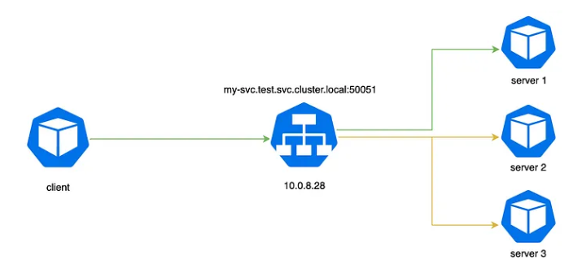
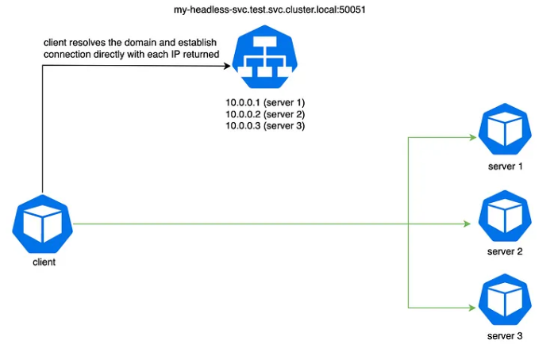

# gRPC

Utilizza protocol buffer che per la serializzazione/deserializzazione è molto più performante rispetto ad un JSON visto che sono byte scambiati. Tra gli svantaggi si può notare che il debugging, ad esempio, è più ostico perchè si necessita di avere un qualcosa che trasforma quei dati in formato leggibili (altrimenti rimangono byte).

## App GRPC rilasciata come Helm Chart in ArgoCD

### 1. Creazione namespace grpc-demo

Aggiungere annotazione:

```yaml
labels: argocd.argoproj.io/managed-by: openshift-gitops
```

### 2. Rilascio applicazione Quarkus

Rilasciamo una applicazione Quarkus che stabilisce una comunicazione client-server con protocollo grpc per verificare la mancanza di bilanciamento (multiplexing)

```yaml
apiVersion: argoproj.io/v1alpha1
kind: Application
metadata:
  name: grpc-demo
  namespace: openshift-gitops
spec:
  destination:
    namespace: grpc-demo
    server: https://kubernetes.default.svc
  source:
    path: grpc/helm-charts/grpc-demo-services
    repoURL: https://github.com/nictore/ocp-demo.git
    targetRevision: HEAD
    helm:
      releaseName: grpc-demo-services
      valueFiles:
      - values.yaml
  sources: []
  project: default
  syncPolicy:
    syncOptions:
      - CreateNamespace=true
```

### 3. Test di comunicazione

Accedere al client grpc ed eseguire:

```bash
oc -n test exec deploy/grpc-client -- curl http://localhost:8080/hello/grpc
```

Verificare i log lato server, solo una istanza ha ricevuto i messaggi

### 4. Osservazioni

**Perché il traffico gRPC non è bilanciato correttamente in Kubernetes?**

Il motivo principale per cui è difficile bilanciare il traffico gRPC è che spesso... si pensa che gRPC sia come HTTP ed è qui che inizia il problema
Mentre HTTP crea e chiude connessioni per richiesta, gRPC opera su protocollo HTTP2 che funziona su una connessione TCP di lunga durata rendendo più difficile il bilanciamento poiché più richieste passano attraverso la stessa connessione grazie alla funzionalità di multiplexing. Tuttavia, ci sono altri errori comuni:

- Configurazione errata del client gRPC
- Configurazione errata del service Kubernetes

## App GRPC con Istio

Rilasciamo la stessa applicazione Quarkus client-server con istio per verificare gestione delle connessioni multiple grazie agli envoy

### 1. Creazione namespace grpc-demo-istio

Aggiungere annotazione:

```yaml
labels: argocd.argoproj.io/managed-by: openshift-gitops
```

### 2. Aggiornare ServiceMeshMemberRoll

```yaml
apiVersion: maistra.io/v1
kind: ServiceMeshMemberRoll
metadata:
  name: default
  namespace: istio-system
spec:
  members:
    - bookinfo
    - grpc-demo-istio
```

### 3. Rilascio app gRPC con Istio

```yaml
apiVersion: argoproj.io/v1alpha1
kind: Application
metadata:
  name: grpc-demo-istio
  namespace: openshift-gitops
spec:
  destination:
    namespace: grpc-demo-istio
    server: https://kubernetes.default.svc
  source:
    path: grpc/helm-charts/grpc-demo-services-istio
    repoURL: https://github.com/nictore/ocp-demo.git
    targetRevision: HEAD
    helm:
      releaseName: grpc-demo-services-istio
      valueFiles:
      - values.yaml
  sources: []
  project: default
  syncPolicy:
    syncOptions:
      - CreateNamespace=true
```

### 4. Test di comunicazione

Accedere al client grpc ed eseguire:

```bash
oc -n test exec deploy/grpc-client -- curl http://localhost:8080/hello/grpc
```

Verifichiamo i log lato server, **traffico bilanciato correttamente**.
I proxy envoy si occupano loro di stabilire una connessione per ciascuno pod e di bilanciare le richieste.

## Accesso gRPC service via ingress controller

Openshift utilizza HAProxy come ingress controller, HTTP2 non è abilitato come impostazione predefinita.
Può essere abilitato come segue:

```bash
oc annotate ingresses.config/cluster ingress.operator.openshift.io/default-enable-http2=true
```

## gRPC senza Istio? (k8s headless service)

Il motivo principale per cui è difficile bilanciare il traffico gRPC è che le persone vedono gRPC come HTTP ed è qui che inizia il problema, in base alla progettazione sono diversi, mentre HTTP crea e chiude le connessioni per richiesta, gRPC opera su un protocollo HTTP2 che funziona su una connessione TCP di lunga durata che rende più difficile il bilanciamento poiché più richieste passano attraverso la stessa connessione grazie alla funzione multiplex.

Senza una service mesh è necessario implementare soluzioni alternative per gestire efficacemente il bilanciamento del carico del traffico gRPC in Kubernetes.
Queste soluzioni possono includere la configurazione diretta dei client per gestire più connessioni server.

### Configurazione client gRPC

Il client gRPC come configurazione predefinita prevede un tipo di connessione 1–1, in ambiente produttivo non funziona come vorremmo.
Il client gRPC predefinito offre la possibilità di connettersi con un semplice record IP/DNS che crea una sola connessione con il servizio di destinazione.
Ecco perché è necessario effettuare una configurazione diversa.

Impostazione di default:

```go
func main(){ 
  conn, err := grpc.Dial("my-domain:50051", grpc.WithInsecure()) 
  if err != nil { 
    log.Fatalf("errore di connessione con il server gRPC: %v", err) 
  }
  ...
```

Impostazione consigliata:

```go
func main(){ 
  addr := fmt.Sprintf("%s:///%s", "dns", " my-domain :50051") 
  conn, err := grpc.Dial(addr, grpc.WithInsecure(),grpc.WithBalancerName(roundrobin.Name)) 
  if err != nil { 
    log.Fatalf("connessione non riuscita: %v", err) 
  } 
  ...
```

In questo modo nel caso in cui il nostro client si connetta a più server, ora il nostro client gRPC è in grado di bilanciare le richieste in base all'algoritmo di bilanciamento scelto.

***N.B. Manca ancora una cosa, assicurarsi che la risoluzione DNS funzioni come ci aspettiamo.***

### Configurazione headless service

La creazione di un service in Kubernetes è piuttosto semplice, basta definire il nome, le porte ed il selector, in modo che il service possa raggruppare i pod dinamicamente e bilanciare automaticamente la richiesta:

```yaml
apiVersion: v1
kind: Service
metadata:
  name: my-service
spec:
  selector:
    app: my-app
  ports:
    - name: grpc
      protocol: TCP
      port: 50051
      targetPort: 50051
```

**Qual è il problema?**
Semplicemente che il service Kubernetes crea un record DNS che collega un solo IP, il clusterIP, quindi quando si fa qualcosa come **nslookup my-service.{namespace}.svc.cluster.local** ciò che viene restituito è un singolo IP, il che ci riporterebbe al problema iniziale:



Risolviamo il problema utilizzando un servizio headless:

```yaml
apiVersion: v1
kind: Service
metadata:
  name: my-service
spec:
 clusterIP: None **LA SOLUZIONE!**
 selector:
    app: my-app
  ports:
    - name: grpc
      protocol: TCP
      port: 50051
      targetPort: 50051
```

Impostando il campo clusterIP in una specifica di servizio su None, il service diventa headless, poiché Kubernetes non gli assegnerà un IP cluster tramite il quale i client potrebbero connettersi ai pod che lo supportano.
Un nslookup così appare un po' diverso, restituisce gli indirizzi IP dei pod associati dando al client gRPC una giusta visibilità del numero di server che devono essere raggiunti.



### Considerazioni

Sebbene la configurazioni appena vista funzioni ci sono delle considerazioni da fare:

- Se il client gRPC deve connettersi a molti server, avere la gestione nell'applicazione aumenterà la complessità ed il consumo di risorse nel tentativo di mantenere molte connessioni aperte.
- Con un service mesh tutta questa configurazione è trasparente ed inoltre indipendente dal linguaggio.